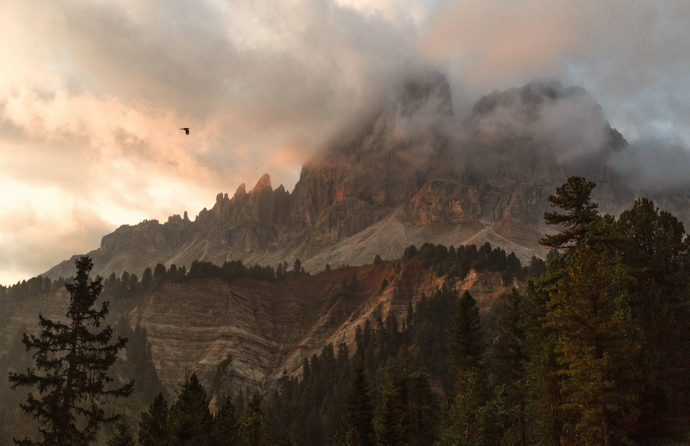

+++
title = "Das Wetter heute"
date = "2023-03-20"
draft = false
pinned = false
tags = ["Wetterbericht", "Deutsch"]
image = "berg.jpg"
+++
## Das Wetter Bild

Die Woche begann mit frühlingshaften Temperaturen - teils sogar im Rekordbereich. Eine Kaltfront, eingefangen von Lukas Wyss, unterbrach diese Frühlingsgefühle vorläufig. Wir gratulieren zum Wettervideo der Woche.

> Vielen Dank für alle tollen SRFMeteo-Videos. Weitere Videos der letzten Woche finden Sie in der Videogalerie.

Weitere Videos der Woche



Der Inhalt einer Box muss wie hier von zwei Blöcken umgeben werden.

Die Woche begann mit frühlingshaften Temperaturen - teils sogar im Rekordbereich. Eine Kaltfront, eingefangen von Lukas Wyss, unterbrach diese Frühlingsgefühle vorläufig. Wir gratulieren zum Wettervideo der Woche.



<iframe width="560" height="315" src="https://www.youtube.com/embed/kVG5Olxl-R4" title="YouTube video player" frameborder="0" allow="accelerometer; autoplay; clipboard-write; encrypted-media; gyroscope; picture-in-picture; web-share" allowfullscreen></iframe>